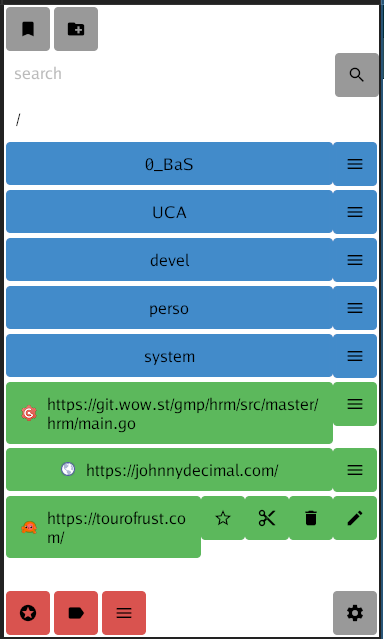

# Web Assembly and Android GUI for my [GoBKM](https://github.com/tbellembois/gobkm) bookmark manager



## WASM compilation

```bash
    GOOS=js GOARCH=wasm go build -o main.wasm
```

## Android compilation

```bash
    export ANDROID_SDK_ROOT=~/Android/Sdk; go run gioui.org/cmd/gogio -target android .
```